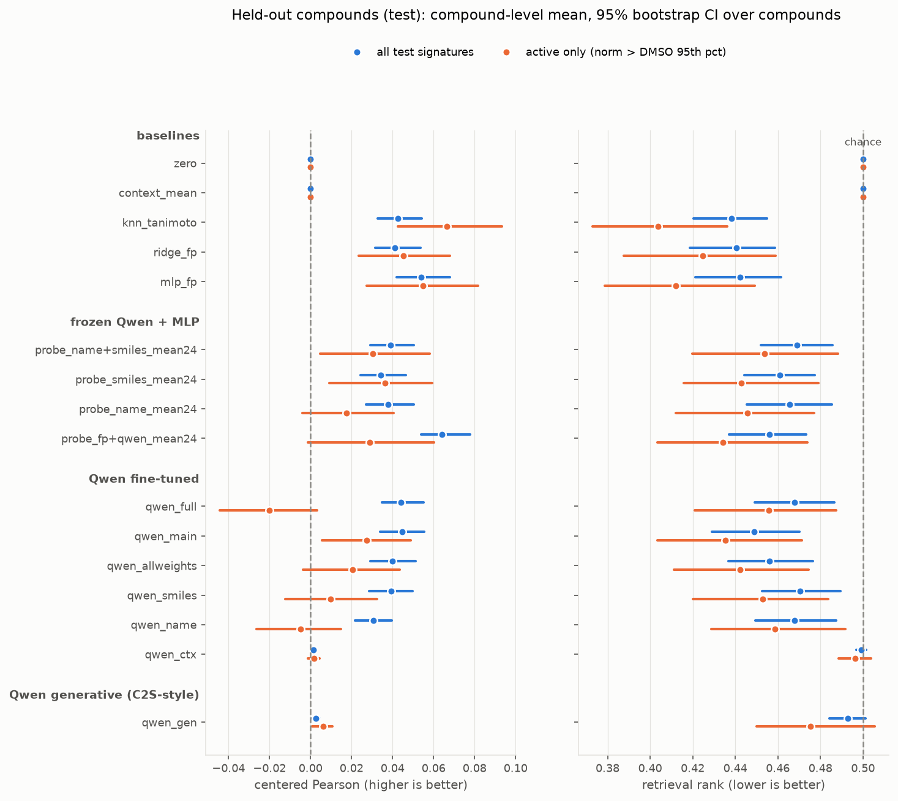
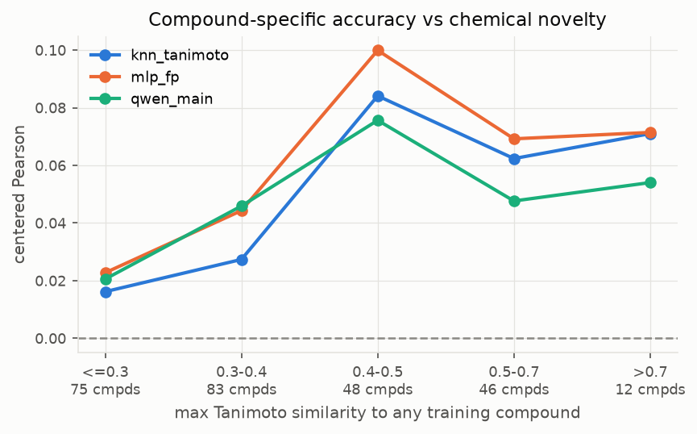

# Perturbation-response prediction on L1000 with Qwen2.5-0.5B

**TL;DR.** On compounds never seen in training, Qwen2.5-0.5B fine-tuned with LoRA to read
"cell / time / dose / name / SMILES" as text **ties a fingerprint MLP** (centered Pearson 0.045 vs
0.054, paired difference -0.009 [-0.022, +0.004]) and is **weaker on the signatures that carry real
signal** (0.027 vs 0.055). Both are far above every compound-agnostic predictor, and a context-only
version of the same LLM scores exactly the null, so the gains come from the compound text, not
metadata. The bigger result is about measurement: on this data the default metric (per-signature
Pearson) is saturated by context, and its obvious fix is gameable by predicting nothing; the
evaluation here is built so that neither shortcut scores.

## 1. Framing

**Question.** Given a cell line, a time point, a dose and a compound the model has never seen, predict
the Level 5 consensus signature over the 978 measured landmark genes.

**Why this version of the question.** It is the version that matters for using such a model: you
want to know what a new molecule will do. It is also the version where shortcuts are easiest to
mistake for skill, because cell line, dose and time explain a large share of what a signature looks
like regardless of which compound was applied. Everything in the evaluation is built to separate
"knows the context" from "knows the compound".

**Unit of evidence.** A compound, not a signature. A typical compound has 42 signatures (7 cell
lines x 6 doses), which are far from independent; all metrics are averaged within compound first and
confidence intervals come from a bootstrap over compounds.

## 2. Data and the pitfalls that shaped the evaluation

Source: GSE70138 Level 5 (118,050 signatures). After restricting to compound treatments and removing
plate controls: 102,797 signatures, 1,794 compounds, mostly 24 h, ~85% from 7 core cell lines.
Split by compound group: 1,316 train / 176 val / 264 test groups (76k / 11k / 15k signatures).
Test compounds are chemically far from training (median max-Tanimoto to train 0.36).

Pitfalls found, in the order they changed the plan:

1. **Plate positive controls.** The entire 20 µM dose level is bortezomib and MG-132, run on every
   REP plate (4,607 signatures, ~4x the norm of a typical signature). Left in, they were 6% of
   training rows, a large share of squared-error mass, and made the context mean look like it
   explained 29% of variance; with them removed it explains 3%. Removed (DECISIONS D4).

2. **Most signatures are noise.** Comparing treated signatures with the DMSO vehicle signatures in
   the same release, the median norm is nearly the same (32.1 vs 30.4) and only **16%** of treated
   signatures exceed the 95th percentile of vehicle (`results/eda/signal_vs_vehicle.png`). I report
   every metric on all signatures and on this "active" subset.

3. **The ceiling is low.** 4,456 conditions were measured twice on different plates. One measurement
   predicts the other with median Pearson **0.19** — 0.63 when both are active, 0.17 otherwise
   (`results/eda/replicate_ceiling.png`). No model should be expected to beat this on average.

4. **Raw Pearson measures the context.** The cell x time x dose training mean, which knows nothing
   about the compound, already scores Pearson 0.20 on held-out compounds — at the replicate ceiling.
   A model can look state-of-the-art on this metric without using the compound at all.

5. **Grouping by structure misses salts and prodrugs.** Three drugs appear under two names with
   different InChIKey skeletons (e.g. ixazomib / ixazomib citrate). None crosses train/test, so test
   scores are clean, but it is a residual risk of any structure-only grouping
   (`notebooks/01_data_tour.ipynb`, section 14).

6. **The obvious fix is also broken.** Correlating residuals from the context mean (`delta_pearson`)
   gives an all-zeros predictor 0.069 — better than Tanimoto kNN and ridge on fingerprints. The
   context mean is pulled by a minority of strongly active training compounds; the typical held-out
   compound is inert, so (observed - mean) points along -mean and "predict nothing" correlates with it.

## 3. Metrics

| metric | what it answers | compound-agnostic model scores |
|---|---|---|
| `centered_pearson` (headline) | Within one cell x time x dose context, does the prediction say how *this* compound differs from the others? (centre predictions and observations per context, then correlate) | exactly 0 |
| `retrieval` (headline) | Given the observed signature, is this compound's prediction closer to it than other compounds' predictions in the same context? (0 = first, 0.5 = chance) | exactly 0.5 |
| `pearson` | conventional per-signature correlation | 0.20 (context mean) |
| `topk_dir` | overlap of predicted vs observed top-50 up and top-50 down genes (a CMap-style query) | 0.155 (context mean) |
| `rmse` | magnitude calibration | 1.124 (context mean) |

Both headline metrics are exactly null for any model that ignores the compound — this is checked
in the results table, where `zero` and `context_mean` score 0.000 and 0.500. Model selection
(kNN k, ridge alpha, MLP epoch, LLM checkpoint, probe pooling) uses val `centered_pearson` only;
test is used once per model for reporting.

## 4. Approach

Every model predicts the residual over the training context mean (cell x time x dose), so all of them
start from the same metadata-only prediction and differ only in what they do with the compound.

**Baselines** (`baselines.py`): `zero`; `context_mean`; `knn_tanimoto` (mean residual of the k most
similar training compounds measured in the same context, Morgan r=2, k=20 chosen on val);
`ridge_fp` (Morgan bits + context one-hots, alpha chosen on val); `mlp_fp` (Morgan bits -> 512, plus
learned cell / time / dose embeddings -> 978; early-stopped on val). `mlp_fp` is the bar to clear: it
sees the same information as the LLM's SMILES line, with no language prior. It is also the core of
chemCPA (molecule + dose + cell -> response); why neither scVI nor a pretrained chemCPA is used is in
DECISIONS D7 (wrong data / task, and a LINCS-pretrained checkpoint would have seen the test labels).

**LLM** (`llm.py`). Qwen2.5-0.5B (revision `060db649...`) reads the condition as five lines of text
(`cell line: A375 (skin)`, `time: 24 h`, `dose: 10 uM`, `compound: <name>`, `smiles: <SMILES>`).
Hidden states of the final layer are mean-pooled over prompt tokens and a linear head maps them to
978 residuals. LoRA r=16 on every attention and MLP projection (9.7M trainable parameters); the head
is zero-initialized so the untrained model reproduces `context_mean` exactly. MSE loss on clipped
z-scores, AdamW, cosine schedule, 6 epochs, length-grouped batches with token-budget micro-batching;
the checkpoint is the best of 24 evaluations on val `centered_pearson`. ~45 min per run on one
laptop RTX 5090. Base weights are adapted (LoRA); no weights are submitted.

**Frozen probe** (`probe.py`). Before spending GPU hours on LoRA variants: embed each compound once
with *frozen* Qwen and pass the embedding through the *same* MLP as `mlp_fp`. Tests whether Qwen's
pretrained representation of a compound beats Morgan bits under an identical downstream model, and
picks the pooling / layer for LoRA on val.

**Ablations at the main config.** `qwen_smiles` (no name line), `qwen_name` (no SMILES line),
`qwen_ctx` (no compound at all: a leakage check that must score the null).

## 5. Results

Test set: 264 compound groups, 15,231 signatures. Compound-level mean with 95% bootstrap CI over
compounds. "Active" = signatures above the DMSO 95th-percentile norm (13% of test signatures).
Full table with every metric and every probe variant: `results/report/summary_test.md`.

| model | centered Pearson | retrieval (0.5 = chance) | centered, active | retrieval, active | raw Pearson |
|---|---|---|---|---|---|
| context_mean | 0.000 | 0.500 | 0.000 | 0.500 | 0.200 |
| qwen_ctx (no compound) | -0.000 [-0.001, 0.001] | 0.500 [0.494, 0.503] | 0.002 | 0.496 | 0.200 |
| knn_tanimoto | 0.043 [0.033, 0.054] | 0.438 [0.420, 0.455] | **0.067** | **0.404** | 0.172 |
| ridge_fp | 0.041 [0.031, 0.054] | 0.440 [0.418, 0.460] | 0.045 | 0.425 | 0.201 |
| **mlp_fp** | **0.054 [0.041, 0.068]** | 0.442 [0.420, 0.462] | 0.055 | 0.412 | 0.181 |
| probe: frozen Qwen (name+SMILES) + MLP | 0.039 [0.029, 0.050] | 0.469 [0.452, 0.485] | 0.030 | 0.454 | 0.192 |
| probe: Morgan ‖ frozen Qwen + MLP | 0.064 [0.053, 0.077] | 0.456 [0.436, 0.473] | 0.029 | 0.434 | 0.178 |
| qwen_full (1st try: EOS pooling, 2 ep) | 0.044 [0.034, 0.055] | 0.468 [0.449, 0.486] | -0.020 | 0.456 | 0.200 |
| **qwen_main** (LoRA, name+SMILES) | 0.045 [0.034, 0.057] | 0.449 [0.429, 0.470] | 0.027 | 0.435 | 0.187 |
| qwen_smiles | 0.039 [0.028, 0.050] | 0.471 [0.453, 0.489] | 0.010 | 0.453 | 0.194 |
| qwen_name | 0.031 [0.022, 0.039] | 0.468 [0.448, 0.488] | -0.005 | 0.459 | 0.174 |

**Paired comparisons** (compound bootstrap, difference in `centered_pearson` / `retrieval`;
negative retrieval = better):

| comparison | centered Pearson | retrieval |
|---|---|---|
| qwen_main - mlp_fp | -0.009 [-0.022, +0.004] | +0.006 [-0.018, +0.032] |
| Morgan‖Qwen probe - mlp_fp | +0.010 [-0.002, +0.022] | +0.014 [-0.008, +0.037] |
| frozen Qwen probe - mlp_fp | -0.015 [-0.027, -0.003] | +0.027 [+0.004, +0.050] |
| qwen_main - qwen_name (value of SMILES) | **+0.014 [+0.004, +0.026]** | -0.019 [-0.042, +0.002] |
| qwen_main - qwen_smiles (value of the name) | +0.006 [-0.005, +0.017] | -0.022 [-0.044, -0.000] |
| qwen_main - frozen probe (value of LoRA) | +0.006 [-0.004, +0.016] | -0.020 [-0.040, +0.000] |

Training-seed spread of `mlp_fp` (4 seeds): `centered_pearson` 0.049–0.053, retrieval 0.444–0.450.
LLM runs are single-seed (see caveats).

**What the numbers say.**
1. *Is the LLM using the compound or metadata shortcuts?* The compound. `qwen_ctx`, the same model
   without the compound lines, scores the null on every compound-specific metric.
2. *Would a simple baseline embarrass it?* Not embarrass, but match: a fingerprint MLP is as good
   overall and better on active signatures, and Tanimoto kNN is the best model on active signatures.
3. *Chemistry or world knowledge?* Mostly chemistry. Removing SMILES costs a significant 0.014 in
   centered Pearson; removing the name costs 0.006 (not significant) in centered Pearson and 0.022 in
   retrieval (borderline: the CI touches 0). The name alone does carry signal (0.031, above the
   null), so Qwen's pretrained knowledge of drug names is real but small and largely redundant with
   structure.
4. *Does fine-tuning matter?* A little. LoRA beats the frozen probe mainly on retrieval
   (-0.020 [-0.040, 0.000]); on centered Pearson the gain is within noise.

**Knowing *whether* vs knowing *what*.** `centered_pearson` mixes two abilities: ranking compounds by
how strongly they act, and getting the direction of the response right. Scoring predicted response
strength as a classifier of the active flag, within context (`results/report/activity_auroc_test.md`):

| model | AUROC (active \| predicted strength) |
|---|---|
| qwen_ctx | 0.494 |
| qwen_name | 0.519 |
| qwen_smiles | 0.549 |
| knn_tanimoto | 0.582 |
| qwen_main | 0.585 |
| mlp_fp | 0.592 |
| Morgan ‖ frozen Qwen probe | **0.623** |

`qwen_main` knows *whether* a compound acts about as well as fingerprints do; where it falls behind is
*which genes* move once it does (active-signature centered Pearson 0.027 vs 0.055). The best activity
ranker is the Morgan + Qwen concatenation — the one place where Qwen measurably adds to chemistry.

**Generalization with chemical novelty** (`results/report/similarity_test.png`). Every model
degrades together as test compounds get further from training chemistry: centered Pearson ~0.02 for
the 75 compounds with max Tanimoto <= 0.3, ~0.08–0.10 at 0.4–0.5. The LLM does not escape this; it
tracks the MLP at low similarity and falls behind at high similarity, where analog lookup is easiest.

**By dose** (`results/report/strata_test.csv`): signal is concentrated at 3.33–10 µM (`mlp_fp` 0.077 /
0.123, `qwen_main` 0.055 / 0.110) and close to zero at 0.04 µM for all models, consistent with most
low-dose signatures being inactive.

## 6. Failure modes

- **Weak where it matters.** On active signatures, the LLM variants trained on one input channel
  score ~0 and the full model about half the MLP. A model judged on all signatures can look
  competitive by predicting which compounds are inert; the active stratum is what exposed this.
- **Novel chemistry is barely predicted by anything.** For the 28% of test compounds with no
  training analog above Tanimoto 0.3, every model is near 0.02. Claims about "new molecules" should
  be read against this bin, not the average.
- **Val-to-test optimism.** Most models score higher on val than test (`mlp_fp` 0.060 vs 0.054),
  partly because val is easier (18.5% active signatures vs 12.7% in test). The largest drops are on
  choices made from a noisy val peak: the probe pooling picked from 4 near-tied options (0.055 ->
  0.039), the SMILES-only probe (0.060 -> 0.034) and the `qwen_smiles` checkpoint (val 0.062 at
  epoch 2.2, test 0.039). With 176 val compounds a single val peak overstates.
- **Small cell lines.** iPSC-derived and primary lines (NEU, NPC, ASC, SKL; 28–32 test compounds
  each) land between -0.03 and +0.05 with no consistent winner and wide intervals; the overall
  numbers are driven by the 7 core lines.
- **Not checked by mechanism of action.** The supplied tables carry no MOA labels (only 10 of
  1,796 compound names state a mechanism, e.g. `GSK-3-inhibitor-II`). Public MOA annotations exist,
  but joining them onto test compounds would cross the no-external-lookup boundary, so a model could
  still be failing completely on one MOA class without this evaluation showing it.
- **The default metric ranks models backwards.** Raw Pearson rewards staying close to the context
  mean: `mlp_fp` has the best compound-specific scores but *lower* raw Pearson (0.181) than
  `context_mean` (0.200) and `qwen_ctx` (0.200).

**Caveats.** LLM runs are single-seed (the MLP's seed spread was measured: 0.004). One incidental
estimate of LLM run-to-run noise: `qwen_smiles` was interrupted by a machine shutdown, scored from
its best checkpoint, then retrained to completion with the same seed; the two runs give test
centered Pearson 0.0389 vs 0.0392 and retrieval 0.466 vs 0.471 (GPU kernels are not bit-deterministic).
That is a lower bound on run-to-run variance, not a substitute for seeds. The split is by compound,
not scaffold.

## 7. What I tried and what changed

| step | what happened | what changed |
|---|---|---|
| raw Pearson as metric | context mean alone = 0.20 = replicate ceiling | added compound-specific metrics |
| `delta_pearson` (residual vs context mean) | all-zeros predictor 0.069, beats kNN and ridge | replaced by within-context centering + retrieval |
| keep all `trt_cp` signatures | 20 µM = two plate-control drugs, 4x norm, 6% of rows | dropped plate controls (D4) |
| first LoRA batching | out of GPU memory on long SMILES | length-grouped batches + token-budget micro-batches |
| first LoRA (EOS token, 2 epochs) | flat for half an epoch; -0.020 on active signatures | ran the frozen probe before more GPU hours |
| frozen probe | mean pooling best on val; frozen Qwen < Morgan bits | LoRA with mean pooling, 6 epochs |
| `qwen_main` | ties MLP overall, behind on active | ablations to see what it uses |
| hypothesis: "LLM knows *whether* not *what*" | half wrong: it knows *whether* as well as FP | reported as a direction gap, not an activity gap |

## 8. What I would do next

1. **Fuse instead of compete.** Feed Morgan bits into the LoRA model's head alongside the pooled
   text state. The frozen concatenation was the best activity ranker (AUROC 0.623) and the best
   overall `centered_pearson` point estimate; it is the cheapest experiment with a plausible gain.
2. **Seeds and a scaffold split.** 3 seeds per LLM config (the cluster's A100s make this a day) and a
   Murcko-scaffold split, so "new chemistry" claims rest on the hardest bin.
3. **Weight the loss by reliability.** 83% of training signatures are indistinguishable from vehicle.
   Level 3 replicates give per-signature reproducibility; down-weighting noise should help most on
   the active stratum where the LLM is weakest.
4. **Ask the model a smaller question.** Separate "will it act?" (a classifier, where the LLM is at
   parity) from "what will it do?" (regression on active signatures only), and evaluate each on its own.
5. **A generative baseline for completeness.** Emit ranked up/down gene symbols and compare on
   `topk_dir`, to test the choice of a regression head (D5) directly rather than by argument.
